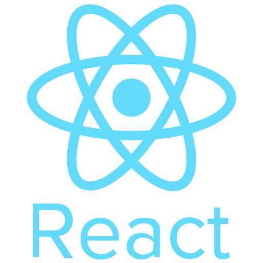
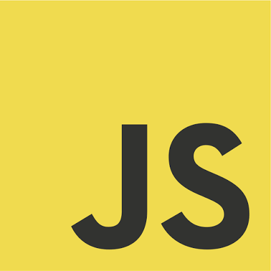
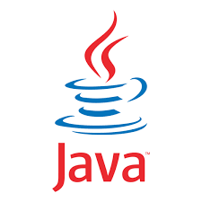
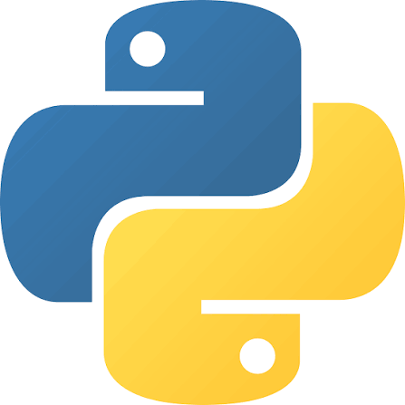
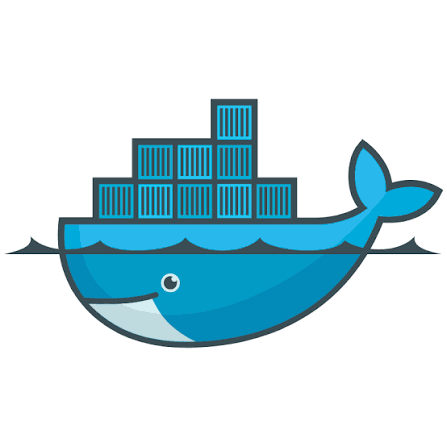
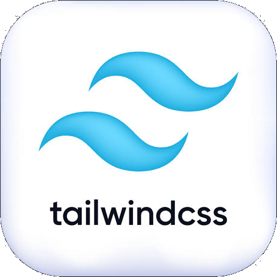

<p align="center">
  
</p>

<p align="center">
  
  
  
  
</p>

---

### 👋 About me

```yaml
Nome: Mauricio Balboa
Cargo: Full Stack Developer 
Formação: Information Systems
Café: always ☕
```

### 💻 Tech Stack

```yaml
Linguagens: TypeScript | JavaScript | Java | Python | Go
Frontend: React | Tailwind CSS
Backend: Node.js | Gin (Go)
Banco de Dados: PostgreSQL | SQLite
Infra: Docker | Nginx
```

<p align="center">
  
  
  
  
  
  
  
</p>
